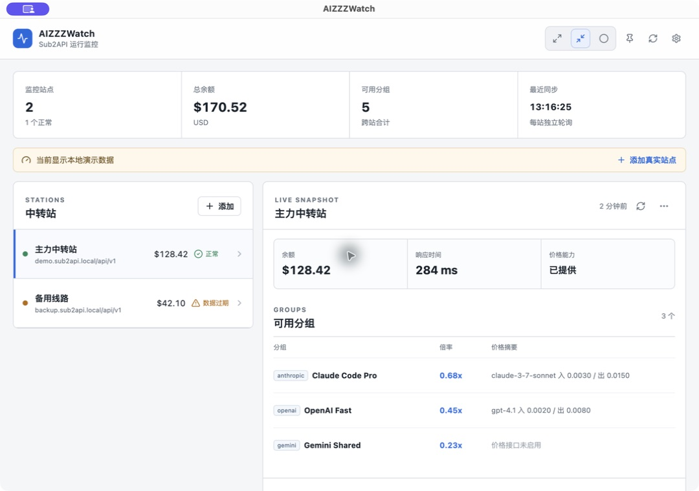
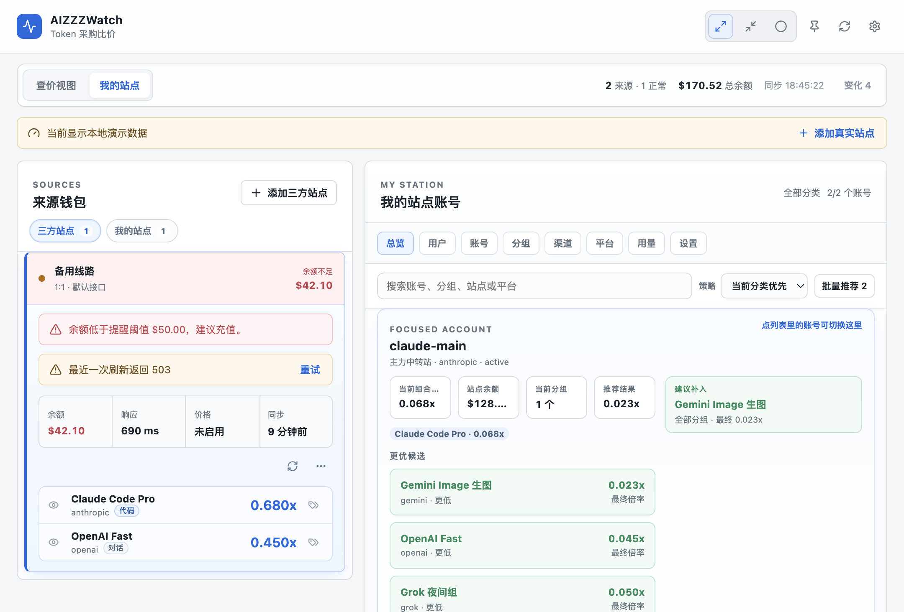
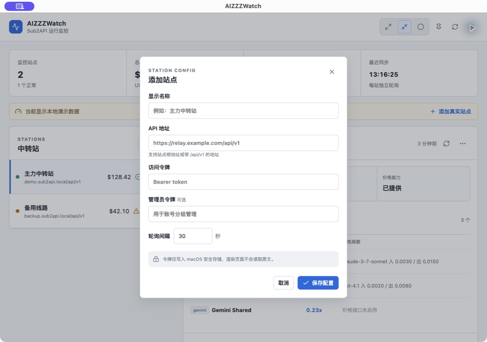

# AIZZZWatch

AIZZZWatch 是一个 macOS 优先的 Sub2API / NewAPI 中转站桌面监控工具。它把三方来源站点、你自己的聚合站点、分组倍率、充值比例、上游密钥、账号成本和收益核算放在同一个本地工具里，方便快速比价、看余额、看变动，并判断自己的分组组合是否会亏。

当前可下载和验证的是 **macOS Apple Silicon（arm64）版本**；Windows 版本正在开发中，暂未发布。

下载已发布版本：[GitHub Releases](https://github.com/iizhan/AIZZZWatch/releases/latest)

项目当前仍处于快速迭代阶段，README 使用的是本地演示数据截图，不包含真实站点令牌、Cookie、邮箱、余额或账号明细。

## 截图







## 赞助与打赏

如果 AIZZZWatch 对你有帮助，欢迎扫码支持后续的站点兼容、稳定性维护和 Windows 版本开发。赞助完全自愿，不影响本项目的 MIT 开源许可和功能使用。

| 收款码一 | 收款码二 |
| --- | --- |
|  |  |

## 核心能力

- 来源钱包：分开管理三方站点和我的站点，展示余额、健康状态、刷新状态和分组倍率。
- 价格榜：按分类、名称、最终倍率、充值比例、涨跌状态和使用状态筛选/排序。
- 最终倍率：把上游倍率和充值比例合并计算，例如 `1 RMB = 10 虚拟币` 且倍率 `0.1x`，等价于 `1:1` 站点的 `0.01x`。
- 分组隐藏：隐藏某个来源分组后，只从“全部/价格榜”移除，不影响来源钱包中继续查看。
- 分组变化：持续记录分组新增、删除、涨价、降价；价格榜展示最新涨跌图标和变动时间。
- 我的站点：以管理员账号读取聚合站账号、分组、渠道、平台、用量和设置相关数据。
- 上游关联：通过三方站点 Key 与我方账号 Key / API Base URL 做自动匹配，减少手工绑定。
- 成本保护：结合上游倍率、充值比例、账号成本、调度状态和用量日志，辅助判断盈利、亏损、接近亏损和基础倍率调整建议。
- 窗口形态：支持完整窗口、置顶紧凑窗口、独立气泡和 macOS 顶部状态栏入口。

## 站点类型

添加站点时可按实际情况选择：

- 自动检测：优先探测站点公开接口和已知二开兼容规则。
- Sub2API：默认使用 `/api/v1` 体系，Key 列表默认路径为 `/keys?page=1&page_size=20&sort_by=created_at&sort_order=desc&timezone=Asia%2FShanghai`。
- NewAPI：读取 NewAPI 风格的用户、账号、渠道和用量接口。
- 自定义：手工配置资料、余额、分组、倍率、价格、Key 列表等读取路径和字段映射。

## 本地数据与安全

AIZZZWatch 默认使用独立的 Electron 数据目录：

```text
~/Library/Application Support/AIZZZWatch
```

可以用 `AIZZZWATCH_USER_DATA_DIR` 指向临时目录做演示或测试，避免碰到真实数据。

敏感边界：

- 访问令牌、刷新令牌、管理员凭据和保存的网页登录账号密码只由 Electron 主进程处理。
- 凭据使用 Electron `safeStorage` 加密；系统无法提供安全存储时会拒绝保存。
- renderer 只接收脱敏站点信息、计数和业务快照。
- 管理员远程写入必须经过可见确认，不做静默切组。
- 仓库只保留演示截图和测试假数据，不应提交真实 `stations.json`、`ui-preferences.json`、HAR、Cookie、JWT、API Key 或私有截图。

发布前请按 [开源发布隐私检查清单](docs/OPEN_SOURCE_CHECKLIST.md) 复核。

## 开发运行

```bash
npm install
npm run dev
```

首次打开且未添加真实站点时，应用会显示本地演示数据。点击右上角设置按钮添加站点，API 地址可填写站点根地址或完整 `/api/v1` 地址。

开发服务器固定使用 `5187` 端口，并启用严格端口检查。应用使用独立的 `AIZZZWatch` 数据目录和单实例锁，不与其他 Electron 开发工具共享配置或重复启动。

## 验证

```bash
npm run verify
```

该命令依次执行 TypeScript 检查、Vitest 测试和 Electron 生产构建。

## 本地 macOS 应用

```bash
npm run package:mac
```

产物位于 `release/AIZZZWatch-darwin-<arch>/AIZZZWatch.app`。公开 Release 提供该 `.app` 的 zip 压缩包，当前仅做本机 ad-hoc 签名，暂不包含开发者身份签名、公证、自动更新和安装器。

下载后解压并拖入“应用程序”文件夹即可。首次运行如被 macOS 拦截，请在 Finder 中按住 Control 点击应用后选择“打开”，或前往“系统设置 → 隐私与安全性”确认放行。

## 目录结构

```text
src/main/              Electron 主进程、站点读取、授权、存储和 IPC
src/preload/           renderer 可访问的安全桥
src/renderer/          React 桌面界面
src/shared/            共享类型、倍率、排序、收益和兼容逻辑
tests/                 Vitest 单元测试
specs/sub2api-monitor/ 需求、验证记录和演示截图
docs/                  开发说明、开源说明和 README 图片
assets/                应用图标资源
```

## 开源协议

本项目以 [MIT License](LICENSE) 发布。

## 开源状态

- 当前版本适合本地开发、演示和代码审阅。
- 真实站点兼容仍依赖各站点接口实现、风控策略和登录态规则。
- 提交公开仓库前，请重新运行隐私扫描并确认暂存区没有真实运行时数据。
